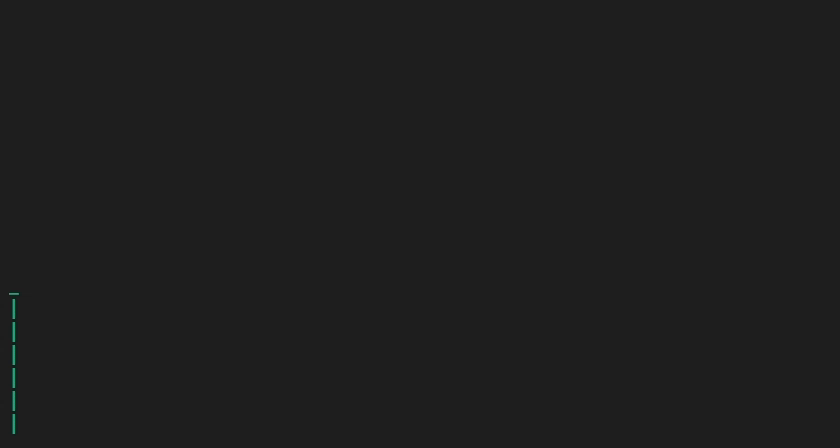

# Jour-1

## Display vertical text : 
> Ecrire une fonction qui permet d’afficher du texte écrite sur plusieurs ligne à la verticale et de façon progressif.
>
Fonctionnalités:
- Affichage verticale et progressif
- Paramétrer un délai (pause)
- Clignotement lors de l'affichage
- Texte en vert lors de l'affichage
- Désactiver l'affichage du curseur lors de l'affichage

Exemple de texte:
```
          ===.
      =====.==`.               __,------._
         ===`.8=);   _/)    .-'           ``-.
         _ (G^ @@__ / '.  .' By Toutatis, the `.
   ,._,-'_`-/,-^( _).__: .' druid's potion has :
  (    / .MMm.Y_)/      ,'   turned me into    |
   `'(|.oMMMM       __,',-'`._  ascii art!   ,'
   d88:'mOom        `--'      `-..______,--''
   88::(::\\d88b
   Y88  ':88888
_________888P__________________________________________________osfa
|                                                                  |
|  Asterix, le heros de ces aventures.  Petit guerrier a l'esprit  |
|  malin, a l'intelligence vive, toutes les missions  perilleuses  |
|  lui sont confiees sans hesitation.  Asterix tire sa force sur-  |
|  humaine de la potion magique du druide Panoramix...             |
|__________________________________________________________________|
```

[Plus d’illustrations d'art ASCII](https://ascii.co.uk/art)

Exemple - test:


[DevByDelta](https://github.com/DevByDelta/30-Jours-30-Projets)